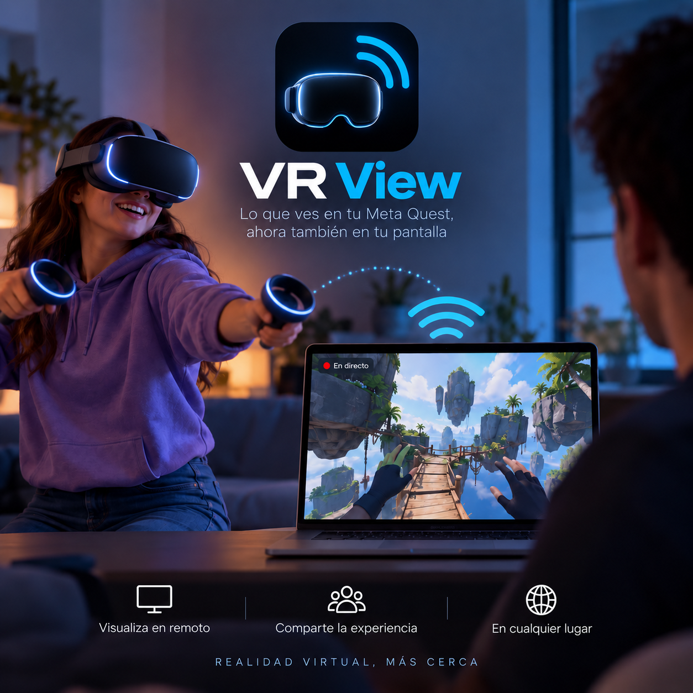

# VR Stream

**Lleva lo que ves en tu visor VR a una pantalla, de forma inalámbrica y a
través de tu red local.**

VR Stream es una aplicación de escritorio de 3GOVideo para visualizar la señal
de un visor compatible en macOS y, próximamente, Windows. Su interfaz simplifica
la conexión inalámbrica, permite elegir entre la vista completa de ambos ojos y
un encuadre 16:9, y ofrece un flujo alternativo con OBS cuando el recorte directo
produce parpadeo.

> VR View es la campaña visual de VR Stream.

## Funciones

- Conexión por IP mediante ADB sobre la red local.
- Vista completa de ambos ojos.
- Vista 16:9 centrada en un ojo.
- Recorte directo con scrcpy para menor latencia.
- Alternativa mediante OBS para evitar parpadeos.
- Guía integrada de recorte, rotación y proyección a pantalla completa.
- Diagnóstico de ADB, scrcpy y dispositivos conectados.
- Ajustes persistentes entre sesiones.

## Disponibilidad

| Plataforma | Estado |
| --- | --- |
| macOS Apple Silicon | Beta privada disponible |
| Windows 64-bit | En preparación |

La versión actual ha sido probada con Meta Quest 2. La compatibilidad puede
variar según el visor, la versión del sistema y la configuración de red.

## Licencia comercial — USD 49

VR Stream es software comercial y propietario. El precio de una licencia
individual es **USD 49**.

Para comprar o solicitar acceso a la beta:

- Sitio: [3govideo.com](https://www.3govideo.com/)

El código fuente y los instaladores comerciales no se distribuyen desde este
repositorio público.

## Requisitos principales

- Visor compatible con ADB y modo desarrollador habilitado.
- Ordenador y visor conectados a la misma red local.
- Wi-Fi de 5 GHz o 6 GHz recomendado.
- OBS Studio es opcional y se utiliza para el modo de recorte estable.

Después de reiniciar el visor puede ser necesario autorizarlo una vez por USB y
activar ADB por TCP/IP.

## Soporte

Usa [GitHub Issues](https://github.com/3GOVideo/vr-stream/issues) para reportar errores sin incluir direcciones
IP privadas, datos personales ni información sensible. Para asuntos de licencia
o ventas, utiliza los canales de contacto disponibles en
[3govideo.com](https://www.3govideo.com/).

## Tecnología y atribuciones

VR Stream utiliza componentes de código abierto, entre ellos
[scrcpy](https://github.com/Genymobile/scrcpy), Android Debug Bridge y
[Electron](https://github.com/electron/electron). Cada componente conserva su
licencia y sus avisos correspondientes. La licencia propietaria de VR Stream no
reemplaza ni limita esas licencias de terceros.

## Marcas

VR Stream es un producto independiente de 3GOVideo y no está afiliado,
patrocinado ni respaldado por Meta Platforms, Google, Genymobile, Electron,
OpenJS Foundation u OBS Studio. Meta Quest es una marca de Meta Platforms, Inc.
y se menciona únicamente para describir compatibilidad.

---

© 2026 3GOVideo. Todos los derechos reservados.
